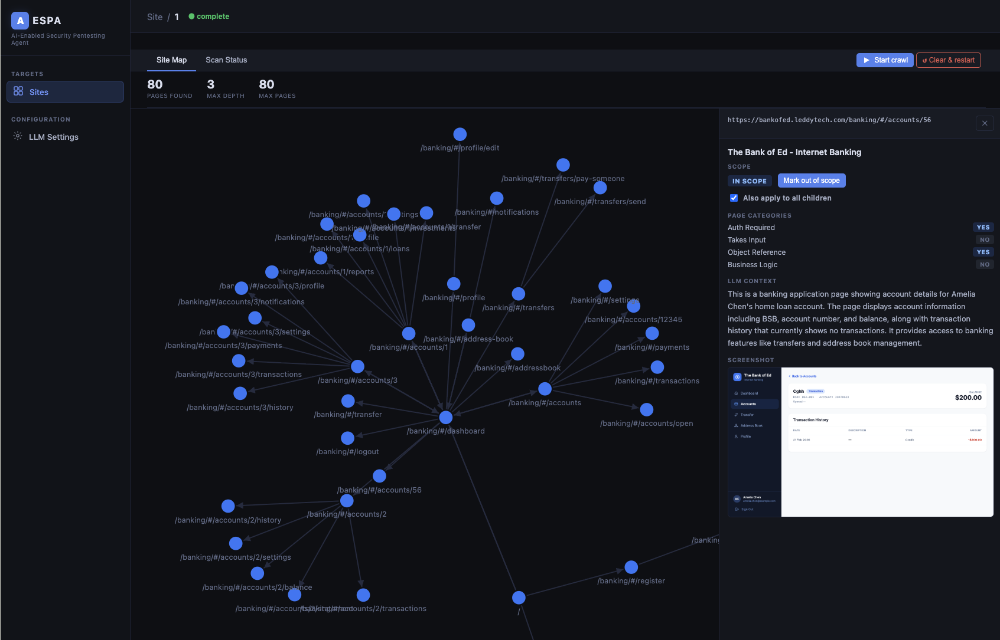
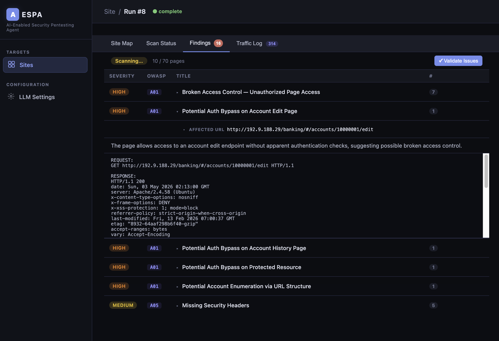

# AESPA — AI-Enabled Security Pentesting Agent

## What is this?

An **exploration** into whether a fully LLM-driven, automated web application "penetration test" could work. 

Here's are [two](docs/juice-shop-results.md) [comparisons](docs/results-comparison.md) of this scanner:
* AESPA + Sonnet 4.6 (AWS Bedrock - account NOT in Cyber Verification Program)
* Claude Code + Sonnet 4.6 (account in Cyber Verification Program)
* Codex + GPT 5.5 (account in Trusted Access for Cyber Program)
* Claude Code + Qwen3.6-35b-A3b (Abliterated)

## How does it work?

See [Architecture](docs/architecture.md).

Also, the [changelog](docs/CHANGELOG.md).

## Requirements

- Python 3.12+
- uv: https://docs.astral.sh/uv/getting-started/installation/
- Burp Suite Professional, if you want to use the active scan integration
- Anthropic/OpenAI/Google/AWS Bedrock API key **OR**
- A local model - some suggestions at the bottom

Note, this was developed/tested mostly on Bedrock/Sonnet 4.6. Your results may vary on a different setup.

## Setup

```bash
# Install dependencies
uv sync

# Install Playwright's Chromium browser (one-time)
uv run playwright install chromium
```

## Running

```bash
uv run aespa
```

The UI is available at `http://127.0.0.1:8000` by default.

Crawls work well on any model, including local models, so you can save a bit of money by using something cheap. Dynamic scans don't work well on local models, I've had the best results on Sonnet 4.6. (I've never tried Opus4.6/4.7/GPT 5.5 due to cost). 

Structured scans are low quality compared to the dynamic scan and will be removed in a later version. (It does, however, provide some usable results on local models.)

## Configuration

Copy `.env.example` to `.env` and adjust as needed:

```bash
cp .env.example .env
```

| Variable | Default | Description |
|---|---|---|
| `AESPA_DATABASE_URL` | `sqlite:///./aespa.db` | SQLAlchemy database URL |
| `AESPA_HOST` | `127.0.0.1` | Bind address |
| `AESPA_PORT` | `8000` | Bind port |

If you don't do this, it will use the values above as the default.

## LLM Configuration

Open the app, go to **LLM Settings**, and configure one of:

- **Anthropic** — requires an Anthropic API key
- **OpenAI** — requires an OpenAI API key
- **Google** - requires a Google API key
- **AWS Bedrock** - requires a Bedrock API key, or you can use boto3 for authentication. Short-term key refresh currently not supported.
- **OpenAI-compatible** — for local models via LM Studio (`http://localhost:1234/v1`) or Ollama (`http://localhost:11434/v1`); no API key required
- **OpenRouter** — requires an OpenRouter API key (`sk-or-v1-...`) 


## Use
Landing page:


Site test runs:


Site setup:


Crawler:


Intelligence Log (populated by crawler and scanners):


Dynamic scan in progress:


Task Graph used by the dynamic scan:


Attack Surface


Traffic log:


Findings


## Recommended models
* Claude Sonnet 4.6 - set output token cap to 60000

Local (~24GB VRAM GPU required)
* Qwen3.6-35b-A3b (Q3) - set output token cap to 10000
* Qwen3-coder-30b - set output token cap to 10000

