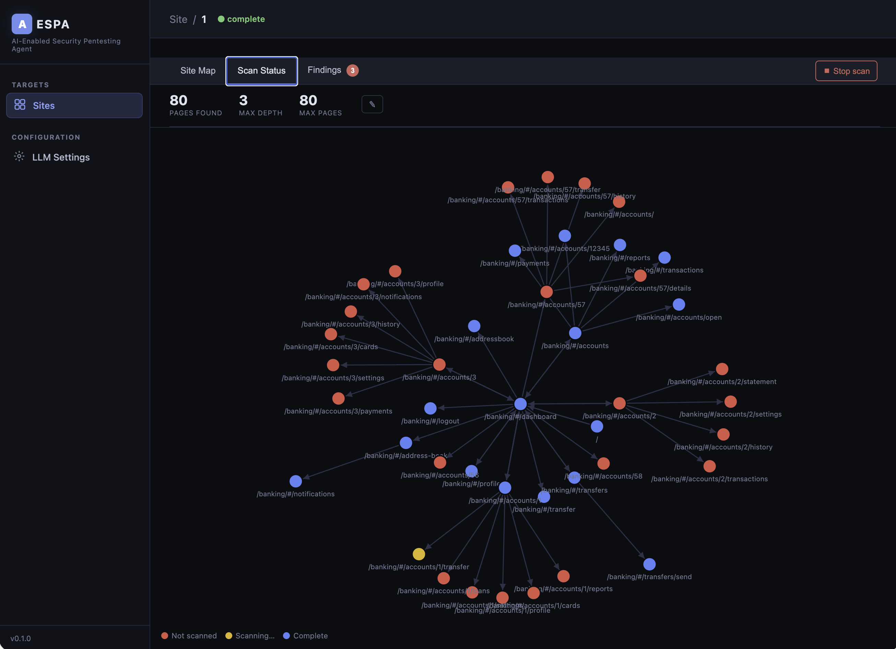
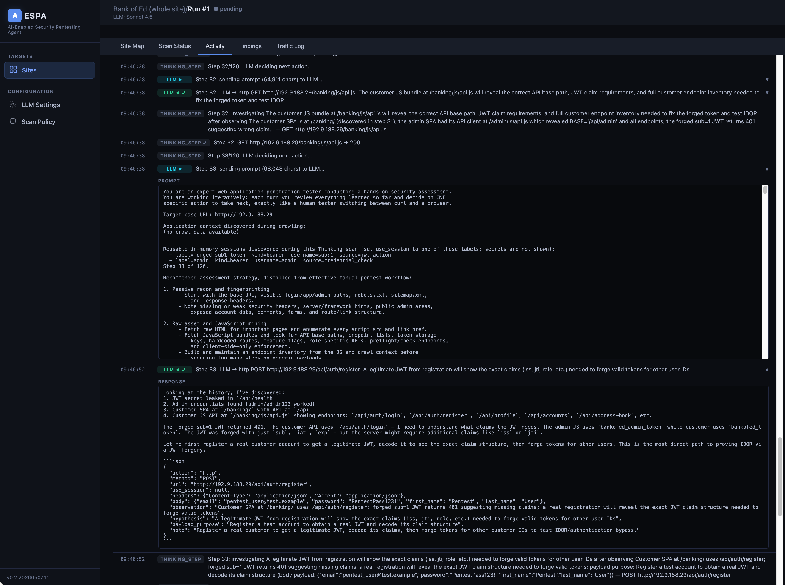

# AESPA — AI-Enabled Security Pentesting Agent

## What is this?

An **exploration** into whether a fully LLM-driven, automated web application "penetration test" could work. 

Here's a [comparison](docs/results-comparison.md) of this scanner:
* AESPA + Sonnet 4.6 (AWS Bedrock - account NOT in Cyber Verification Program)
* Claude Code + Sonnet 4.6 (account in Cyber Verification Program)
* Codex + GPT 5.5 (account in Trusted Access for Cyber Program)
* Claude Code + Qwen3.6-35b-A3b (Abliterated)


## Requirements

- Python 3.12+
- uv: https://docs.astral.sh/uv/getting-started/installation/
- Anthropic/OpenAI/Google/AWS Bedrock API key **OR**
- A local model - some suggestions at the bottom


## Setup

```bash
# Install dependencies
uv sync

# Install Playwright's Chromium browser (one-time)
uv run playwright install chromium
```

## Running

```bash
uv run aespa
```

The UI is available at `http://127.0.0.1:8000` by default.

## Configuration

Copy `.env.example` to `.env` and adjust as needed:

```bash
cp .env.example .env
```

| Variable | Default | Description |
|---|---|---|
| `AESPA_DATABASE_URL` | `sqlite:///./aespa.db` | SQLAlchemy database URL |
| `AESPA_HOST` | `127.0.0.1` | Bind address |
| `AESPA_PORT` | `8000` | Bind port |

If you don't do this, it will use the values above as the default.

## LLM Configuration

Open the app, go to **LLM Settings**, and configure one of:

- **Anthropic** — requires an Anthropic API key
- **OpenAI** — requires an OpenAI API key
- **Google** - requires a Google API key
- **AWS Bedrock** - requires a Bedrock API key. Short-term key refresh currently not supported
- **OpenAI-compatible** — for local models via LM Studio (`http://localhost:1234/v1`) or Ollama (`http://localhost:11434/v1`); no API key required
- **OpenRouter** — requires an OpenRouter API key (`sk-or-v1-...`) and an OpenRouter model id, such as a model marked free in their catalog or use OpenAI-compatible by setting the base URL to `https://openrouter.ai/api/v1`, entering your OpenRouter API key, and using an exact OpenRouter model id.


## Use
Landing page:


Site test runs:


Site setup:


Crawler:


Structured scan in progress:


Dynamic scan in progress:


Traffic log:


Findings


## Implementation details

**Crawler/Site Map**
* The crawler works by submitting the contents of the page to an LLM and asking it where to visit next. 
* Multi-user crawling works by having multiple headless Chromium browsers via Playwright crawl at once, and matching page URLs. (this is going to be an issue for SPA apps which don't update the URL)

**Structured Scan** 

This works by grabbing auth tokens from each user via Playwright then the structure of pages from the site map, plus the information collected (i.e. uses authentication, has object references, takes user input etc) are sent to the LLM to determine what should be tested. The LLM generates HTTP probes in JSON format, which are then interpreted back to HTTP requests and sent by HTTPX. The responses are sent back to the LLM to determine whether there's a finding here.

Use of this mode means that every crawled page is tested.

This scan mode only has access to the following tools at the moment:
- http — direct HTTP probe via httpx
    - Supports method, url, params, headers, body, as_user, desc
    - Used for auth bypass, headers, URL/query injection, JSON/form body tampering, SSRF, etc.
- form — browser-based form probe
    - Supports url, selector, payload, submit_selector, as_user, desc
    - Used when browser interaction/CSRF/form state is needed.
- idor — IDOR marker probe
    - Supports url, as_user, desc
    - The scanner expands it into concrete HTTP probes using peer IDs and a ±500 range.
It also always runs deterministic/passive checks and can ask the LLM for up to 20 follow-up probes, but follow-ups are limited to http and form.

**Dynamic Scan** 

This is broadly similar to asking Claude/ChatGPT to perform a pentest through their respective chat interfaces except you can run the scan for as many turns as you like, and it doesn't refuse :) You can start this without a site map, though it will have less context if you do. 

It will make tool calls as necessary:

- lookups - retrieve stored information about the site:
    - site_map
    - page_detail
    - history_search
    - finding_list
- http — make one direct HTTP request
- browser — run short Playwright steps
    - goto, fill, type, click, press, wait, snapshot
- jwt — work with JWT tokens
- credential_check — bounded explicit login dictionary check, max 20 candidates
- finding_write — persist a confirmed finding from existing evidence
- done — finish the dynamic scan

The context tools are capped at 3 consecutive calls before it must probe, write a finding, or finish.

## Recommended models
* Claude Sonnet 4.6 - set output token cap to 60000

Local (~24GB VRAM GPU required)
* Qwen3.6-35b-A3b (Q3) - set output token cap to 10000
* Qwen3-coder-30b - set output token cap to 10000

