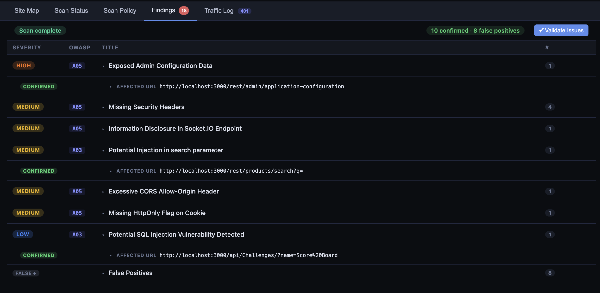

# AESPA — AI-Enabled Security Pentesting Agent

## What is this?

An **exploration** into whether a fully LLM-driven, automated web application "penetration test" could work. 

(so far, it doesn't look like it with the qwen3-coder-30b model, which is the only one which will run acceptably on my laptop. anyone got an API key they can lend me?)

## Requirements

- Python 3.12+
- uv: https://docs.astral.sh/uv/getting-started/installation/
- Anthropic/OpenAI/Google API key **OR**
- A local model, you will need a GPU with 20GB+ VRAM or an ARM Macbook Pro with 32GB+ RAM. I recommend LM Studio + a non-thinking model that runs 30+ tok/sec. Thinking models will run too slowly for this app to offer a good experience.


## Setup

```bash
# Install dependencies
uv sync

# Install Playwright's Chromium browser (one-time)
uv run playwright install chromium
```

## Running

```bash
uv run aespa
```

The UI is available at `http://127.0.0.1:8000` by default.

## Configuration

Copy `.env.example` to `.env` and adjust as needed:

```bash
cp .env.example .env
```

| Variable | Default | Description |
|---|---|---|
| `AESPA_DATABASE_URL` | `sqlite:///./aespa.db` | SQLAlchemy database URL |
| `AESPA_HOST` | `127.0.0.1` | Bind address |
| `AESPA_PORT` | `8000` | Bind port |

If you don't do this, it will use the values above as the default.

## LLM Configuration

Open the app, go to **LLM Settings**, and configure one of:

- **Anthropic** — requires an Anthropic API key
- **OpenAI** — requires an OpenAI API key
- **Google** - requires a Google API key
- **OpenAI-compatible** — for local models via LM Studio (`http://localhost:1234/v1`) or Ollama (`http://localhost:11434/v1`); no API key required
- **OpenRouter** — requires an OpenRouter API key (`sk-or-v1-...`) and an OpenRouter model id, such as a model marked free in their catalog

OpenRouter can also be configured through **OpenAI-compatible** by setting the base URL to `https://openrouter.ai/api/v1`, entering your OpenRouter API key, and using an exact OpenRouter model id.

## Use
Landing page:


Site setup:


Crawler:


Scan in progress:


Traffic log:


Findings (run against OWASP Juice Shop)



## Dev comments:

**Crawler/Site Map** - "mostly works"
* The crawler works by submitting the contents of the page to an LLM and asking it where to visit next. 
* Multi-user crawling works by having multiple headless Chromium browsers via Playwright crawl at once, and matching page URLs. (this is going to be an issue for SPA apps which don't update the URL)

**Scan** 
* This works by grabbing auth tokens from each user via Playwright then the structure of pages from the site map, plus the information collected (i.e. uses authentication, has object references, takes user input etc) are sent to the LLM to determine what should be tested. The LLM generates HTTP probes in JSON format, which are then interpreted back to HTTP requests and sent by HTTPX. The responses are sent back to the LLM to determine whether there's a finding here.
* I've been testing this with qwen3-coder-30b which is the only model that runs acceptably fast locally and the results aren't very good, it's mostly false positives. Need to adjust prompts + test with a better model
* Testing raw prompts directly against qwen3-coder, I've observed that it doesn't give very good security testing advice in general, hah.
