# AESPA — AI-Enabled Security Pentesting Agent

[](https://deepwiki.com/ledwardchow/aespa) 

## What is this?

An **exploration** into whether a fully LLM-driven, automated web application/API "penetration tests" could work.

## What should I use it for?

Testing :) It's got a cool UI and stuff.

**This is not a replacement for human testers; it can help you scale.** If you run an offensive security team and have a lot of websites/APIs you need to work through, running this first can help you prioritise what to put testers on.

## Features

Multi-agent (test lead + specialists, adversarial validator and reporting) web app and API testing.

You will need to provide:

- For web app testing - URL and (optionally) credentials
- For API testing - documentation so that the scanner can understand the structure of the APIs in scope (OpenAPI YAML, text dumps of Confluence pages, markdown, free text files containing API credentials; just upload whatever you have and the scanner will figure it out!)
- (Optionally) ZIP of the source code for the web app/API. You can run SAST as a standalone operation or load the SAST findings into a web or API scan, which will validate the finding with dynamic testing
- An API key for a supported LLM provider, AWS credentials, a GitHub Copilot subscription, or a ChatGPT/Codex subscription with Codex installed separately

## Performance

Here's are [two](docs/results/juice-shop-results.md) [comparisons](docs/results/results-comparison.md) of this scanner, run against the [Bank of Ed](https://github.com/ledwardchow/BankOfEd/tree/vulnerable-version):

- AESPA + Sonnet 4.6 
- Claude Code + Sonnet 4.6
- Codex + GPT 5.5 
- Claude Code + Qwen3.6-35b-A3b

And a [comparison](docs/results/vuln-scanner-comparison.md) of a single (specialist agents turned off) vs multi-agent scan. As of 27th May 2026, a multi-agent scan on the Bank of Ed costs about $7.50 USD on Sonnet 4.6 token prices and about $1.50 on Deepseek v4 Flash prices (against the first-party API).

Also, scan results for [VAmPI](docs/results/vampi/vampi.md).

## Documentation

The [Architecture](docs/architecture.md).

The [changelog](CHANGELOG.md).

The [User Guide](docs/guide/index.md)!

## Requirements

- Burp Suite Professional, if you want to use the active scan integration
- One of: an Anthropic/OpenAI/Google/AWS Bedrock API key, a GitHub Copilot subscription, a ChatGPT/Codex subscription with the Codex CLI installed, or a local model

Note, this was developed/tested mostly on Bedrock/Sonnet 4.6. Your results may vary on a different setup.

If your API key has TPM/RPM quota caps this is configurable in the LLM Settings UI. If left unconfigured i've seen this consume up to ~10m TPM bursts (inclusive of cached tokens).


## Running (macOS/Windows)

Standalone binaries for Windows and macOS are available at [GitHub releases](https://github.com/ledwardchow/aespa/releases). The macOS binaries are notarised. 

These versions run in the background in the menubar or systray - click on the icon to open the interface/quit the background process. 

## Running with Docker

The image bundles Chromium, so no separate Playwright install is needed.

### From Docker Hub

The image is published at [ledwardchow/aespa](https://hub.docker.com/r/ledwardchow/aespa). To run it without cloning this repo:

```bash
docker run -p 8000:8000 ledwardchow/aespa
```

Then open `http://localhost:8000`.

### From a clone

```bash
docker compose up -d        # pull the image, publish port 8000, persist data
```

Then open `http://localhost:8000`. The DB and uploads persist in the `aespa-data` volume across restarts. `docker compose down` to stop.

To build and run locally instead of pulling the published image:

```bash
docker compose up -d --build
```

## Running from source

### Setup

Requirements:
- Python 3.12+
- uv: [https://docs.astral.sh/uv/getting-started/installation/](https://docs.astral.sh/uv/getting-started/installation/)

Clone or download a zip of this repository. Within a terminal with the working directory set to the root of the repo:

```bash
# Install dependencies
uv sync

# Install Playwright's Chromium browser (one-time)
uv run playwright install chromium
```

### Run

```bash
uv run aespa
```

The UI is available at `http://127.0.0.1:8000` by default.

The terminal has four live log views. Press `1` for HTTP requests, `2` for
Python errors, `3` for LLM requests and responses, or `4` for agent activity.
The LLM view shows full prompt content and may include credentials or target data supplied to a scan.
Each payload is enclosed by a delimiter that identifies the calling operation,
request type, direction, and matching call number.
LLM calls are collapsed to one row in the terminal by default. In the LLM view,
use Up and Down to select a call and Enter to expand or collapse its request and
response payloads.
The number keys switch views immediately, without pressing Enter. Logs stay
inside a fixed terminal window. Use Page Up and Page Down to move through older
and newer pages. The right-side scrollbar and header percentage show how far
back the current page is from live output. Page numbers increase toward the
newest content. Paging into older output keeps that page fixed while new log
records arrive; returning to the newest page resumes live updates.
The viewport reflows automatically when the terminal is resized.

### Frontend build (only for UI development)

The compiled frontend bundle is committed under `src/aespa/web/` to make runs/deployment easier. 

The frontend source is a Vite + React app in `frontend/`. After editing files under `frontend/src/`, rebuild the bundle:

```bash
cd frontend
npm ci            # first time only
npm run build     # regenerates src/aespa/web/
```

### Run notes

Crawls work well enough on any model, including local models, so you can save a bit of money by using something cheap. Dynamic scans don't work well on local models; for best results, use Sonnet, or the budget option is Minimax M3.

If your site is authenticated and you don't have credentials, you can start a dynamic scan directly without a site map. The agents will just have less context about what it is testing upfront.

This app is intended for use on a computer you're sitting in front of. Note to those who want to host this on anything other than localhost, this app has **NO SECURITY**, the API is **unauthenticated** and passwords/API keys you save in this app can be stolen straight off the page; you should use an authenticating reverse proxy such as Cloudflare/Tailscale for a headless instance.

## Configuration

Copy `.env.example` to `.env` and adjust as needed:

```bash
cp .env.example .env
```

| Variable             | Default                | Description                                       |
| -------------------- | ---------------------- | ------------------------------------------------- |
| `AESPA_DATABASE_URL` | `sqlite:///./aespa.db` | SQLAlchemy database URL                           |
| `AESPA_HOST`         | `127.0.0.1`            | Bind address                                      |
| `AESPA_PORT`         | `8000`                 | Bind port                                         |
| `AESPA_WEB_DIR`      | `./src/aespa/web`      | Path to static web UI assets                      |
| `AESPA_DATA_DIR`     | `./aespa_data`         | Path to persistent uploads and temporary storage  |

If you don't do this, it will use the values above as the default.

## LLM Configuration

Open the app, go to **Settings → LLM**, and configure:

- **Providers** — reusable connection settings with a name, API format, optional base URL, API key, and model names. Built-in formats include GitHub Copilot, Factory Droid CLI, Anthropic, OpenAI, OpenAI-compatible, OpenRouter, Google Gemini, Amazon Bedrock Runtime, Amazon Bedrock Mantle, Azure OpenAI, and Azure AI Foundry. Use **Load models from API** to automatically discover available models for supported providers. Use OpenAI-compatible for local models such as LM Studio (`http://localhost:1234/v1`) or Ollama (`http://localhost:11434/v1`). For Factory Droid, credentials are used directly from Droid CLI. For GitHub Copilot, leave the username and token blank to use Copilot CLI's selected default account. For Bedrock, leave the API key blank to use boto3 credentials from `AWS_PROFILE`, environment variables, SSO, or the instance role.
- **Models & Profiles** — configure model parameters (max tokens, temperature, vision support) and create scan profiles. Scan profiles set default models and allow per-agent-role model assignments (e.g. assigning separate models for Test Lead, Specialist, Validator, or ALICE).
- **Import / Export** — export or import your entire LLM configuration (providers, models, profiles) as a JSON file.

## Use

Landing page:  
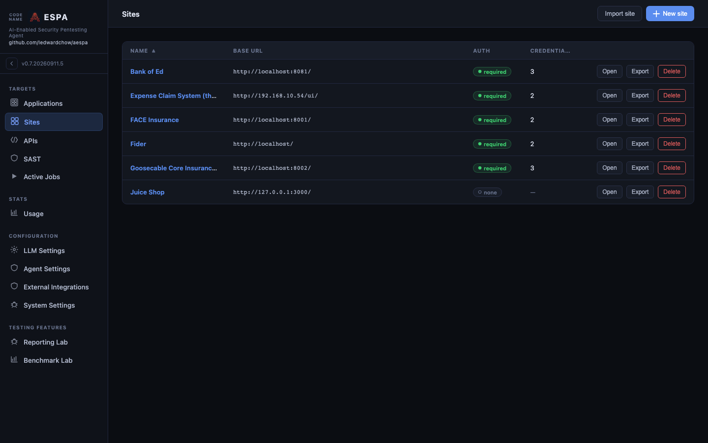

Site test runs:  
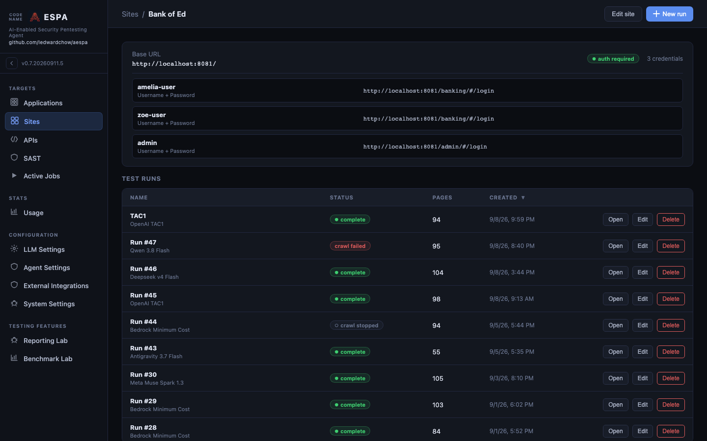

Site setup:  
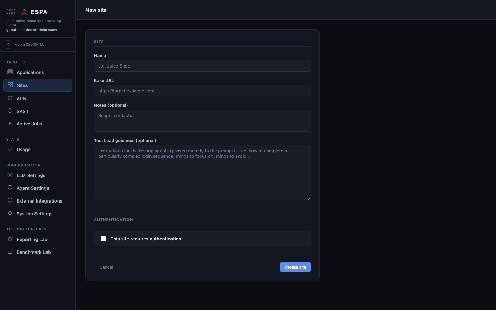

Site Map:  
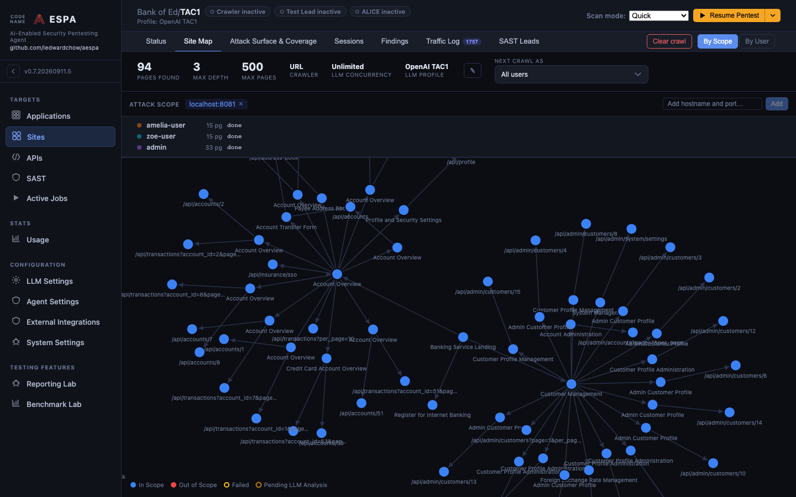

A.L.I.C.E chat:  
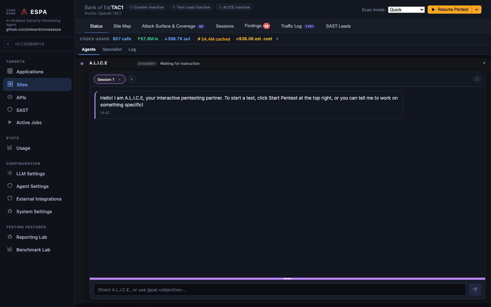

Agents view: 


Attack Surface  
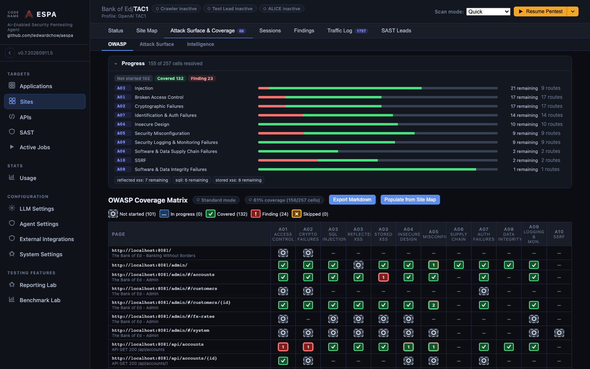

Traffic log:  
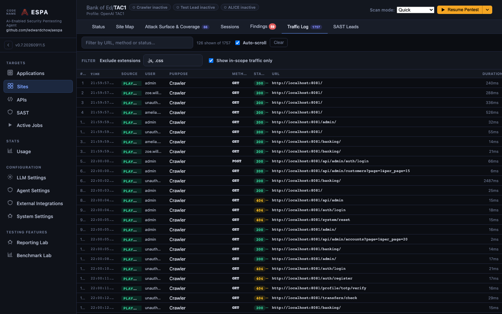

Findings  
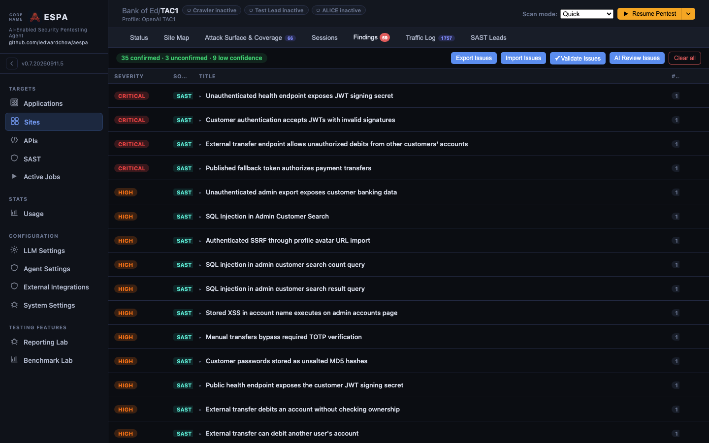

API Setup  
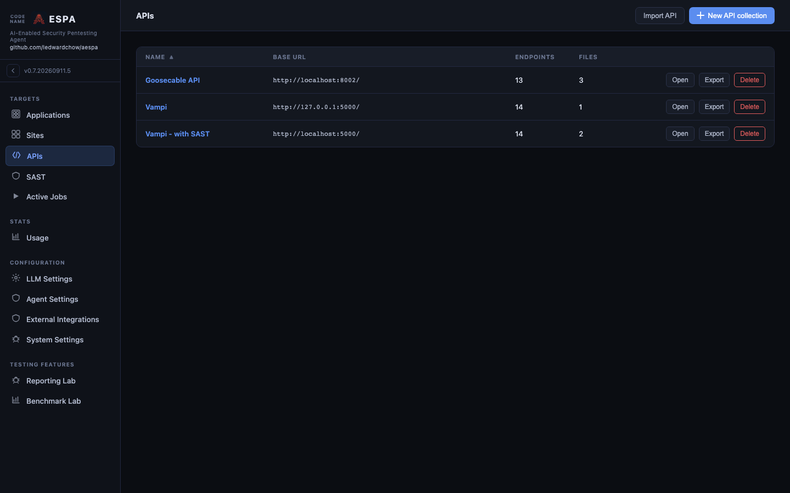

Parsed API documentation  
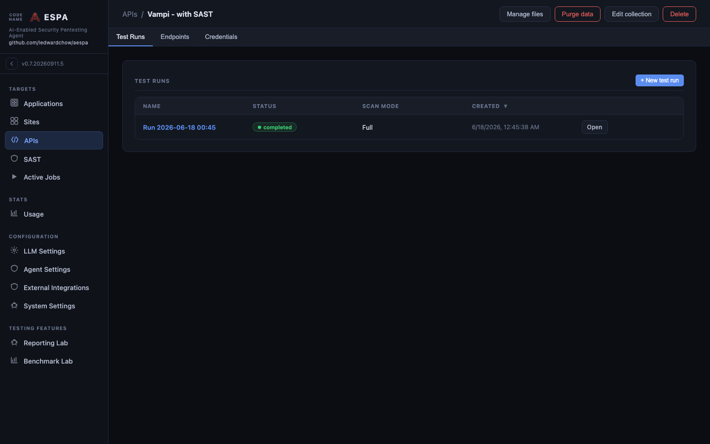

SAST Scan-based Lead Detection  
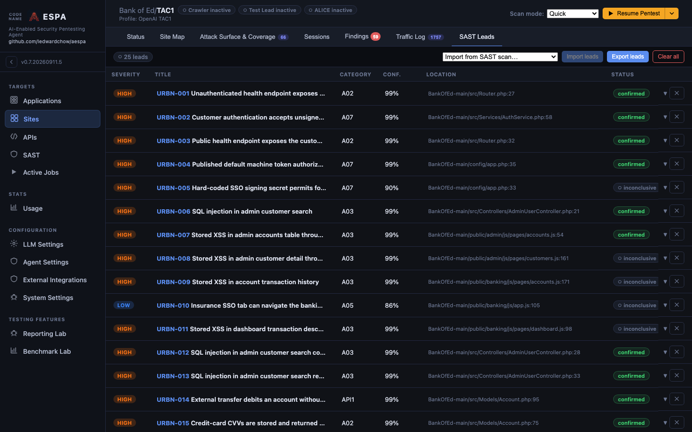

OWASP Coverage for API Scanning  
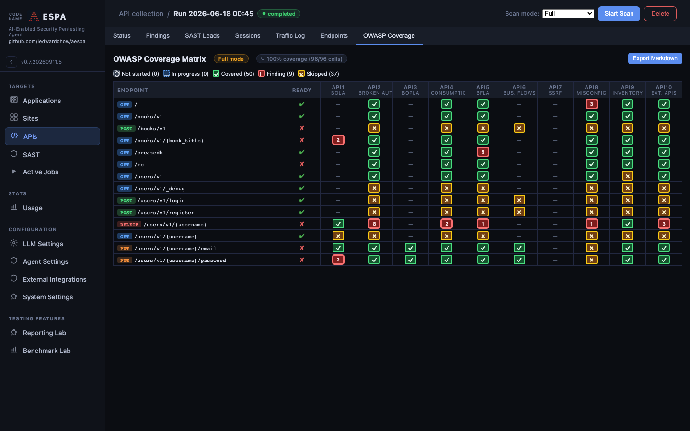

API Scan Findings  
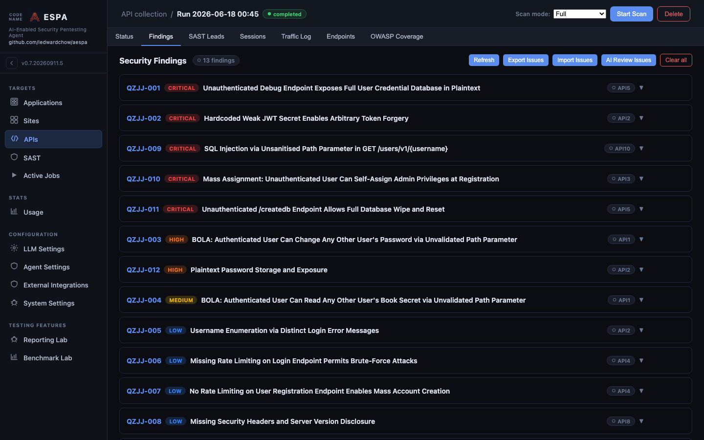

## Recommended models

- Claude Sonnet 4.6 - Doesn't seem to trigger refusals even without CVP.
- Sonnet 5 works about as well as 4.6 and doesn't trigger refusals.
- Opus 4.8 triggers refusals if not on CVP, but usually not immediately (it'll complete a "quick" mode scan most of the time)
- GPT 5.4/5.5/5.6 work well, but you need an account with Trusted Access or the scanner will terminate early/frequent refusals.
- Minimax M3
- GLM 5.2
