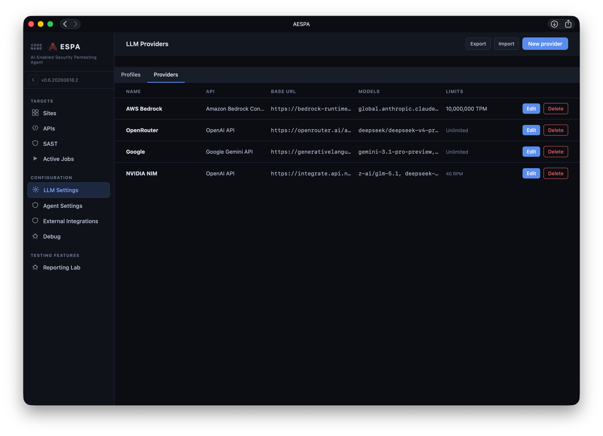
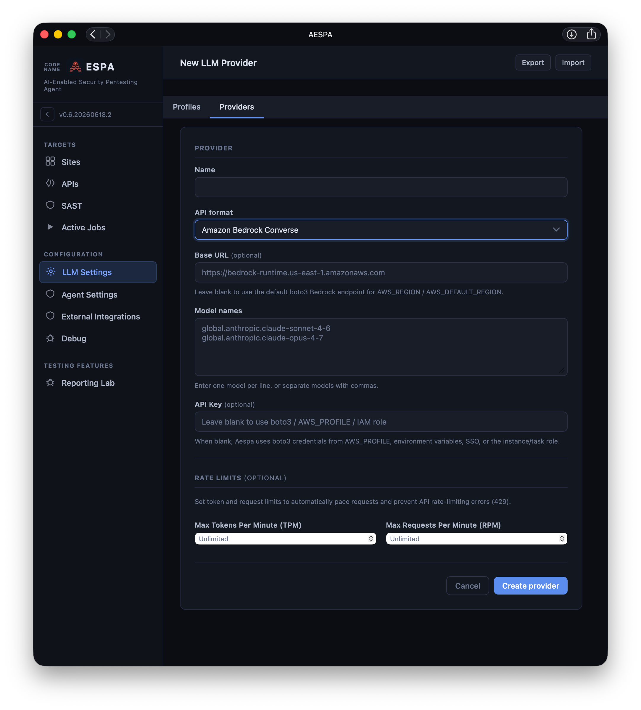
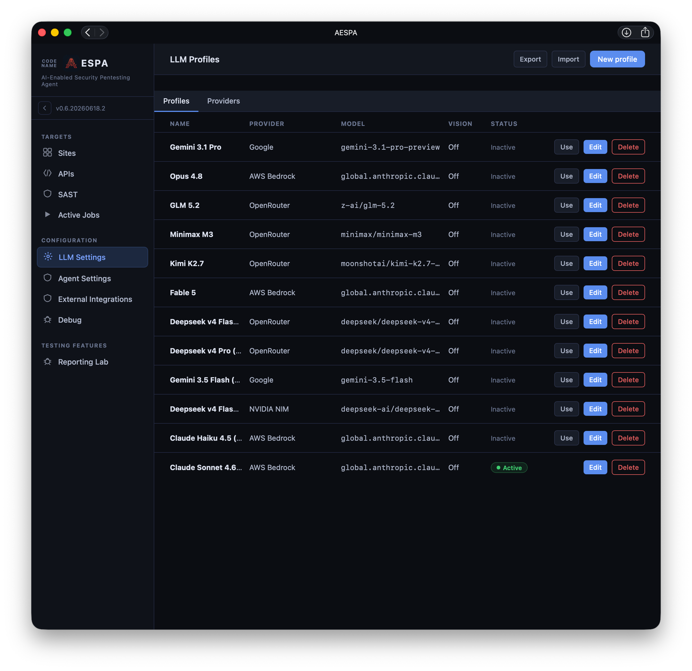
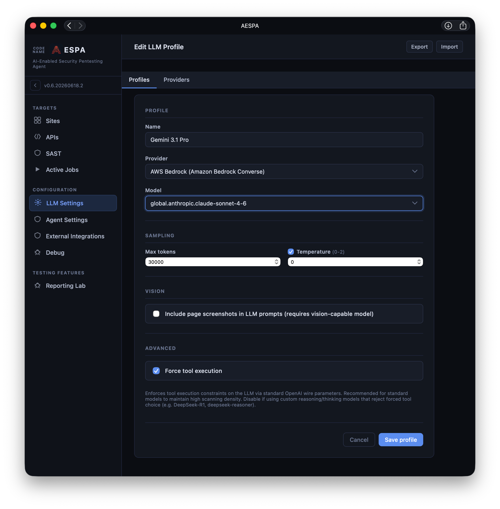

# Configuring LLMs

For AESPA to work, you need to set up model providers. AESPA supports AWS Bedrock Runtime, Azure OpenAI, OpenAI-compatible and Anthropic API formats.

A **Provider** is an API endpoint and a list of models which it can supply.

A **Profile** allows you to configure settings for a specific model - max tokens, temperature, whether the model has vision capability, and whether tool execution should be forced. You can select a default system-wide profile, and optionally a specific profile can be selected per scan run.

## Configuring a provider

Click on "New Provider" on the top right to create one:

Set a name for your LLM provider (it will show up in the profile creation as this name).

The following providers can be selected as an API format to pre-fill the Base URL:
- OpenRouter (https://openrouter.ai/api/v1)
- Anthropic API (https://api.anthropic.com)
- OpenAI API (https://api.openai.com/v1)
- Google Gemini API (https://generativelanguage.googleapis.com)

The following API format selector values will require you to input your base URL:
- OpenAI-compatible API (select this if you are using a locally hosted model - i.e. Ollama, LM Studio)
- Amazon Bedrock Runtime (https://bedrock-runtime.REGIONNAME.amazonaws.com)
- Amazon Bedrock Mantle (https://bedrock-mantle.REGIONNAME.api.aws/v1 — OpenAI-compatible; leave the Base URL blank to default to us-east-2)
- Azure OpenAI (https://RESOURCENAME.openai.azure.com)
- Azure AI Foundry (OpenAI API) (https://RESOURCENAME.services.ai.azure.com/openai/v1)
- Azure AI Foundry (Anthropic API) (https://RESOURCENAME.services.ai.azure.com/anthropic/v1)

You will need to enter model names (you can obtain these from your provider) - one per line.
For all providers (except Amazon Bedrock Runtime), you must enter an API key. If you selected Amazon Bedrock Runtime, you can provide an API key OR leave it blank to use the default AWS SDK/boto3 profile installed on your machine. Amazon Bedrock Mantle is OpenAI-compatible: supply an Amazon Bedrock API key (sent as a Bearer token), OR leave the key blank to authenticate with AWS credentials — requests are then SigV4-signed using the boto3 credential chain (AWS_PROFILE, environment variables, SSO, or an IAM role), the same fallback as the Amazon Bedrock Runtime provider. AESPA drives Mantle via the OpenAI **Responses** API, so it works with the frontier `openai.gpt-5.x` models and the `openai.gpt-oss-*` models. Claude models are not available over Mantle's OpenAI APIs — use the Amazon Bedrock Runtime provider for those.

If you have a rate limit/quota on your LLM provider, enter them here and AESPA will pace LLM calls to ensure you don't exceed it. If you leave it blank, it will run as fast as it can - I've seen it consume up to ~10m TPM for a single scan in bursts. (If you have a limit and you don't fill this in, your LLM calls will fail and your scans will break. An error message will show up in the scan log if this is the case.)

## Configuring a profile

Click on **New Profile** at the top right to create a profile. 

Click on **Use** on a profile to select it as the default profile.

### Create/edit profile screen

The models you entered for the provider will show up in the drop down. Set the max tokens, temperature, vision and tool execution settings for your model and click Save.

Your model **must** support either Anthropic tool calling/OpenAI function calling for it to work in AESPA. There is no specific error message if you select a model that doesn't support this! Your scans may just terminate early.

Vision support is optional; tick the box to send captured screenshots to the model when pages are queried out of the context tool, this may improve feature discovery.

Note the following model restrictions:
- Haiku 4.5 supports a maximum of 64000 output tokens.
- Opus 4.8 does not support the **temperature** setting; turn it off for this model.
- Many models that aren't from OpenAI or Anthropic don't support forcing tool execution.