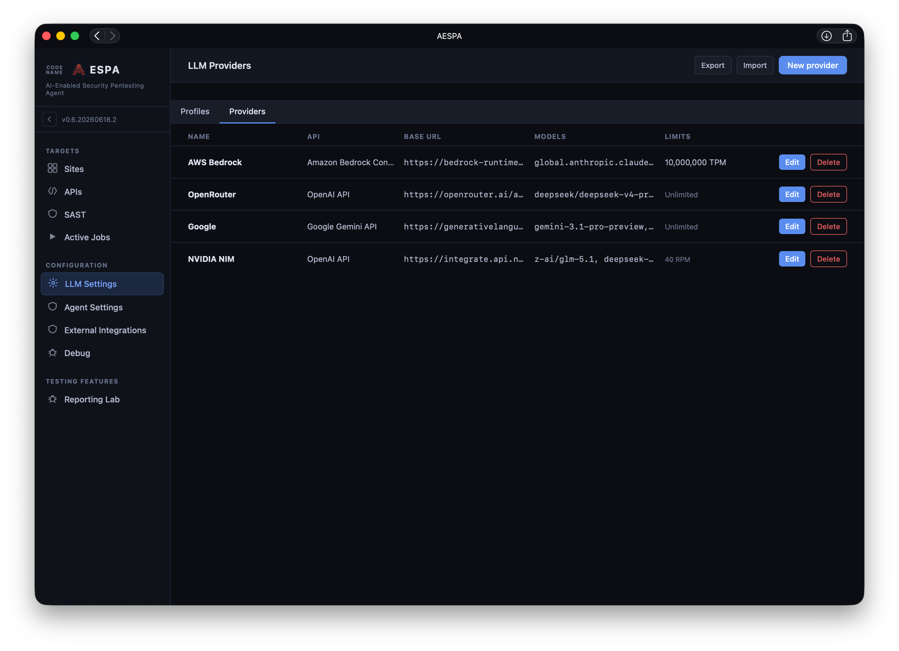

# Configuring LLMs

To use AESPA, you must configure an LLM provider and scan profile. AESPA supports Anthropic, OpenAI, GitHub Copilot subscriptions, Factory Droid subscriptions, AWS Bedrock Runtime, AWS Bedrock Mantle, Azure OpenAI, Azure AI Foundry, OpenRouter, Google Gemini, and OpenAI-compatible endpoints.

AESPA uses a three-tier configuration model:
1. **Providers**: Connections to LLM services, storing authentication, base URLs, rate limits, and model discovery settings.
2. **Models**: Model definitions linked to a provider, setting parameters such as max tokens, temperature, vision capabilities, and forced tool choice.
3. **Profiles**: Named scan profiles selecting a default model, with optional per-role model overrides (e.g. using separate models for Test Lead, Specialist, Validator, or A.L.I.C.E.).

---

## Configuring a Provider

Click **New Provider** on the Providers tab:

Set a name for your provider and choose an API format:

Pre-filled or managed endpoints:
- **Anthropic API** (`https://api.anthropic.com`)
- **Factory Droid subscription** (uses Droid CLI signed-in account credentials automatically)
- **GitHub Copilot subscription** (uses official GitHub Copilot SDK)
- **OpenAI API** (`https://api.openai.com/v1`)
- **Google Gemini API** (`https://generativelanguage.googleapis.com`)
- **OpenRouter** (`https://openrouter.ai/api/v1`)

Endpoints requiring a Base URL or custom configuration:
- **OpenAI-compatible API** (for local models via LM Studio, Ollama, etc.)
- **Amazon Bedrock Runtime** (`https://bedrock-runtime.REGIONNAME.amazonaws.com`)
- **Amazon Bedrock Mantle** (OpenAI-compatible; leave Base URL blank to default to `us-east-2`)
- **Azure OpenAI** (`https://RESOURCENAME.openai.azure.com`)
- **Azure AI Foundry (OpenAI API)** (`https://RESOURCENAME.services.ai.azure.com/openai/v1`)
- **Azure AI Foundry (Anthropic API)** (`https://RESOURCENAME.services.ai.azure.com/anthropic/v1`)

### Dynamic Model Discovery

Click **Load models from API** to fetch available model names dynamically for supported providers (e.g. GitHub Copilot, Factory Droid). Alternatively, enter model names manually (one per line) or leave the field blank to use default placeholders.

### Authentication & Parameters

- **Factory Droid**: Uses credentials from Droid CLI. No API key input needed.
- **GitHub Copilot**: Leave username and token blank to use Copilot CLI's default account, or enter a login from `/user` to select an account. Enter an explicit GitHub user token for headless setups.
- **Amazon Bedrock Runtime**: Leave API key blank to use `boto3` / `AWS_PROFILE` / IAM instance role credentials.
- **Amazon Bedrock Mantle**: Provide an Amazon Bedrock API key or leave blank for AWS IAM credentials. You can optionally enter a **Project ID** (`proj_...`) to attach an `OpenAI-Project` header for cost tracking.
- **Rate Limits**: Configure Max Tokens Per Minute (TPM) and Max Requests Per Minute (RPM). AESPA automatically paces requests to avoid HTTP 429 rate limit errors.

---

## Configuring Models & Profiles

### 1. Models (`LLMConfig`)

On the **Models** tab, click **New Model** to define model settings:
- **Provider**: Select the provider that supplies this model.
- **Model Name**: Select or enter the model identifier.
- **Max Tokens**: Maximum output token limit per response.
- **Temperature**: Sampling temperature (uncheck to omit temperature for models that do not support it, such as Opus 4.8).
- **Vision**: Enable to send page screenshots when queried via context tools.
- **Force Tool Choice**: Enable for models requiring explicit tool choice enforcement.

### 2. Scan Profiles (`LLMProfile`)

On the **Profiles** tab, click **New Profile** to create a scan profile:
- **Default Model**: Select the baseline model used for all agents in runs using this profile.
- **Role Overrides**: Optionally assign specific models to individual agent roles:
  - **Test Lead**: Main pentest orchestrator loop.
  - **Specialist Agent**: Deep-dive vulnerability specialists.
  - **Adversarial Validator**: Disproof validator.
  - **A.L.I.C.E.**: Interactive pentest chat agent.

Click **Use** on a profile to set it as the default system-wide profile.

---

## Importing & Exporting Configurations

Use the **Export** and **Import** buttons in the top right of the LLM Settings page to transfer configurations:
- **Export**: Downloads a JSON file containing all providers, models, and scan profiles.
- **Import**: Uploads a JSON file to restore or merge providers, models, and profiles into AESPA.
