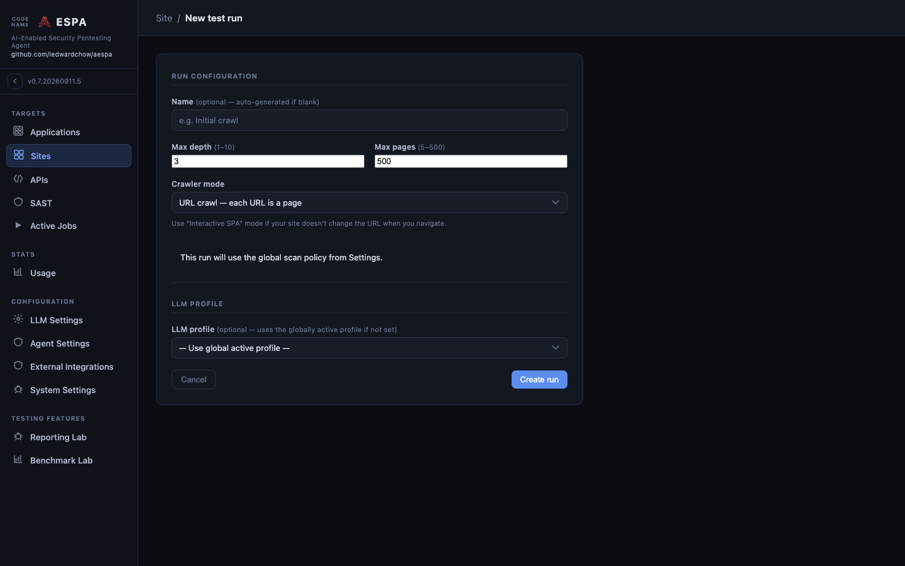
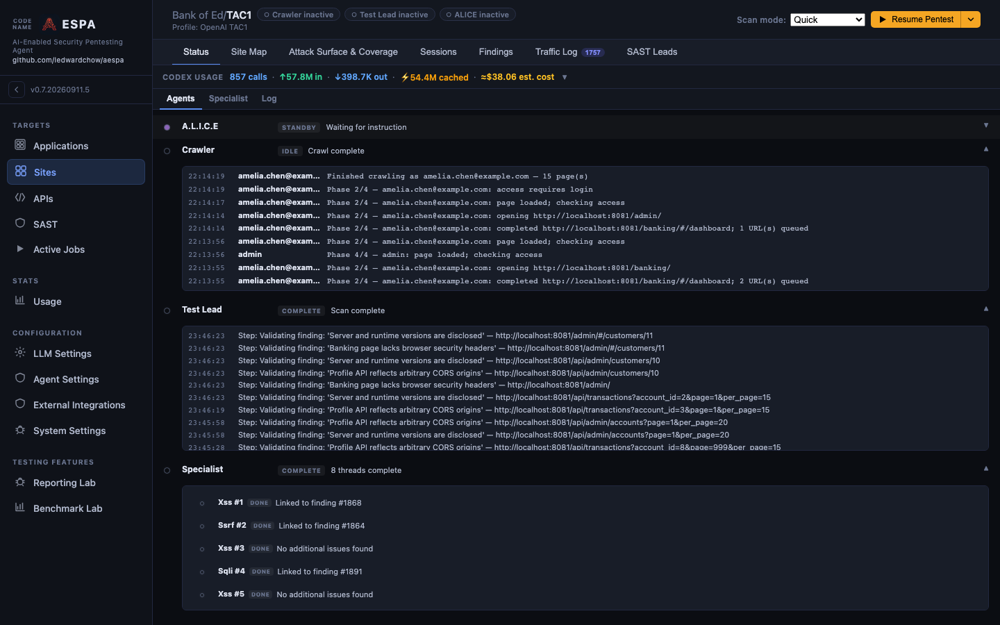

# Web Scanning - Screen Walkthrough

## Sites

The **Sites** page lists saved web targets.

Use **New site** to add a target. A site contains its base URL, optional scope
hosts, scan guidance, and login credentials. Site export includes the site's runs
and can be large when crawled screenshots are present.

## Site and credentials

Each credential can use its own login URL. Authentication modes are:

- **Auto**: Fills a normal username and password form.
- **TOTP**: Fills the login form and generates a time-based one-time password.
- **Entra ID**: Handles Microsoft's multi-page login flow, including supported
  consent, account selection, Authenticator approval, and TOTP screens.
- **Guided**: Opens a visible browser for passkeys, unusual SSO, or another flow
  that needs manual input. Finish the login, return to the run page, and confirm
  that it is complete.

Keep the run page open during interactive authentication so AESPA can show
approval, retry, and completion prompts.

## Test runs

Create a run to choose its LLM profile, crawl depth, maximum pages, crawler mode,
and scan mode. The dynamic coverage choices are:

- **Quick**: Adaptive testing with coverage tracking.
- **Standard**: Requires the percentage configured in Agent Settings.
- **Full**: Resolves every applicable page and OWASP category obligation.
- **SAST Validate**: Tests only imported SAST leads.

## Status

The **Status** tab contains crawl and pentest controls, token usage, ALICE, agent
status, specialist activity, and the event log.

A normal workflow is to run **Start Crawl**, review the discovered scope, and
then run **Start Pentest**. A pentest can start without a completed crawl, but the
Test Lead will have less context.

## Site Map

The Site Map shows discovered URLs and interactive states. Use its scope and user
views to compare reachability. Selecting a page opens its details, including page
flags, user access, and scope controls.

## Attack Surface & Coverage

This tab combines the route and input inventory with live OWASP coverage. Routes
show method, normalized path, parameters, provenance, access observations, and
evidence-backed signals. Coverage is tracked for each applicable page and OWASP
category. Full mode continues until each obligation is covered or skipped with a
reason.

## Sessions

The **Sessions** tab lists cookies and tokens captured during login, crawling,
dynamic testing, or ALICE work. Named sessions are available to the Test Lead and
ALICE. Deactivate a session when it should no longer be used.

## Findings

The **Findings** tab shows severity, CVSS, evidence, validation status, and
supporting files. Supported fields can be edited from the finding details panel.
You can retry validation, validate a group of findings, or ask ALICE to review
duplicates and ratings.

## Traffic Log and SAST Leads

The **Traffic Log** contains requests and responses from the crawler, Test Lead,
specialists, ALICE, and brokered Python execution. Entries keep their agent,
session, page, and coverage attribution.

The **SAST Leads** tab imports reportable leads from a completed standalone SAST
run. Imported leads are copies owned by the web run. Quick and SAST Validate runs
must resolve their open imported leads before completing.
