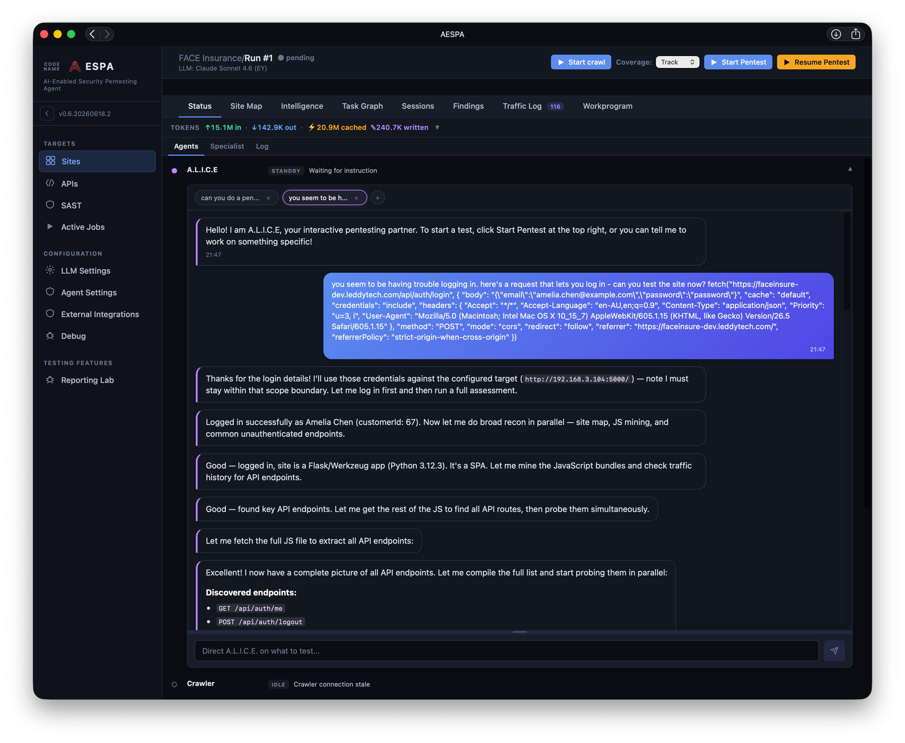

# Running Web Scans

You can kick off a scan action by doing one or more of the following:
- Clicking **Start Crawl**
- Clicking **Start Pentest** (although I recommend doing a crawl first)
- Telling the A.L.I.C.E. chat agent what you want it to do

## Using the automated pentest mode
If you just want the whole application covered, click **Start Crawl**, wait for the crawl to finish, then click **Start Pentest**. 

You will see the progress of the scan/status of each agent on the Status screen as it goes:

The Test Lead is an agentic loop which has a prompt instructing it to be a pentester working on the target site, with access to [tools](../agent-tool-reference.md) that give it information/memory on what it is working on. It can kick off the Specialist agent when it finds functionality which maybe susceptible to a particular vulnerability class; the specialist agent has a prompt which focuses only on that class (i.e. IDOR, business logic, SQLi) and a limited set of tools, to keep it focused. 

When it finds an issue, it will kick off the Reporting agent to write up the issue, then hand off to the Validator agent, which will attempt to confirm the finding by disproving it.

## Using A.L.I.C.E.
You can also talk to the ALICE bot; you can think of ALICE as a Test Lead you can talk to. 

ALICE is separate to the built-in Test Lead, you can use it concurrently if you like. 

ALICE has access to [all tools](../agent-tool-reference.md) that any other agent has, so you can ask it to do things like:
- Can you perform a penetration test of the admin section of this app only?
- Can you tell me what findings affect the customer section of the app?
- The are 3 SQL injection findings that look like duplicates. Can you go through all the findings, check whether they are duplicated, and merge/remove them as necessary?
- Can you clean up the OWASP Coverage matrix? It looks like there are some URLs which you hit, but don't show properly - check your work? 
- The rating on the Information Disclosure finding looks a bit high - can you review all issues and reconsider the ratings? 

You can also use ALICE to "unstick" the automated pentester if it gets stuck - try giving it a fetch/curl command for a login function that's not well-exposed by the site:

## Working with Findings
After a scan finishes you may find that, especially with non-frontier models the quality of the reporting may not be quite up to scratch:
- The same finding may be reported multiple times
- Findings may be over/underrated in severity 

You can click the **AI Review Issues** button to fix most of these problems; this will queue up a prompt with ALICE to clean up duplicates and ratings.

If there are any further problems, you can ask ALICE to fix it; unfortunately it is not possible to directly edit issues at this time short of editing it in the SQLite db directly.