# Frontend Route Resolution Implementation Plan

## Purpose

This plan is the implementation handoff for Luna. It improves Application campaign
scanning so a backend SAST finding is sent to a web DAST child only when AESPA can
connect it to a concrete frontend page, action, and browser request on that target.

The existing campaign workflow remains SAST-led:

```text
SAST -> component correlation -> human review -> crawl -> focused DAST validation
```

This work changes the handoff between correlation, crawl, and focused validation. It
does not add a new scan type or run an independent full DAST scan.

## Problem To Fix

The current implementation can queue work that the selected target cannot perform.
There are three related causes.

1. A server-side outbound call may be represented as `frontend_entrypoint`. The live
   resolver then looks for that server-to-server route in browser traffic.
2. Approved mappings and explicitly owned component leads are copied into target runs
   before live route resolution has established that they are runnable.
3. An unresolved route is retained in the target's open lead queue. The Test Lead then
   spends scan budget determining that the route belongs to another origin, requires a
   different role, or is not exposed by that target.

Campaign 187 demonstrates the failure. FACE browser traffic used routes such as
`POST /api/quotes/motor`, while the server-side GooseCable hop used routes such as
`POST /api/customer/quotes/motor`. Several leads searched for the latter at the FACE
origin and returned 404 even though other leads in the same run observed the former.

The implementation must preserve each hop and use the browser-visible hop for live
resolution.

## Desired Behaviour

A web validation is runnable only when AESPA has both:

- a complete, evidence-backed static trace from a frontend root to the SAST lead; and
- a live binding between that trace's browser request and crawl evidence from the
  selected Site child run.

The required path shape is:

```mermaid
flowchart LR
    UI[UI route or state] --> ACTION[UI action]
    ACTION --> BROWSER[Browser request]
    BROWSER --> FRONT_ROUTE[Frontend server ingress]
    FRONT_ROUTE --> FRONT_HANDLER[Frontend server handler]
    FRONT_HANDLER --> OUTBOUND[Frontend server egress]
    OUTBOUND --> BACK_ROUTE[Backend server ingress]
    BACK_ROUTE --> BACK_HANDLER[Backend handler or service]
    BACK_HANDLER --> LEAD[SAST lead anchor]
```



Not every application needs every node. A browser-only SPA can omit the frontend
server ingress and egress hops. A server-rendered application may begin with a form
submission rather than a JavaScript request. The trace grammar must still distinguish
browser-visible requests from server-to-server calls.

For FACEInsure and GooseCable, the expected path is:

```text
/quotes/motor page
-> Submit quote action
-> browser POST /api/quotes/motor
-> FACE Flask POST /api/quotes/motor
-> FACE outbound POST /api/customer/quotes/motor
-> GooseCable POST /api/customer/quotes/motor
-> policy creation and binding logic
-> SAST lead anchor
```

## Design Decisions

### Keep mappings and executable cases separate

`LeadTargetMapping` remains the human-reviewed statement that a source lead may belong
to a target. Approval authorizes AESPA to resolve and prepare the path. Approval does
not prove reachability and does not directly place a lead in a scan queue.

Add a `CampaignValidationCase` model for executable work. One mapping may produce one
or more cases later, but the first implementation may create one case per mapping.
This boundary avoids adding execution state to the already overloaded mapping row.

Suggested model:

```python
class CampaignValidationCase(SQLModel, table=True):
    id: int | None
    campaign_id: int
    mapping_id: int
    target_member_id: int
    origin_lead_id: int
    assertion_key: str
    static_path_json: str
    live_binding_json: str
    readiness_status: str
    blocker_codes_json: str
    copied_lead_id: int | None
    finding_id: int | None
    execution_status: str
    created_at: datetime
    updated_at: datetime
```

Add a uniqueness constraint over `(mapping_id, target_member_id, assertion_key)`.
Use foreign keys for the campaign, mapping, target member, source lead, copied lead,
and finding where the existing deletion order permits them. Update campaign cleanup
to delete validation cases before mappings, leads, target members, and child runs.

Initial status values:

- `readiness_status`: `pending`, `resolved`, `static_complete`, `ambiguous`,
  `missing_frontend_hop`, `missing_backend_hop`, `missing_prerequisite`,
  `wrong_target`, `crawl_failed`, `legacy_unresolved`.
- `execution_status`: `not_queued`, `queued`, `running`, `confirmed`, `dismissed`,
  `inconclusive`, `skipped`.

Keep status values as strings, consistent with the current models. Validate them at
service and schema boundaries.

### Introduce attack-path schema version 3

Do not continue adding overloaded fields to the version 2 attack path. Add helpers in
`services/route_tracing.py` to create, parse, and validate a version 3 document.

The version 3 shape should be:

```json
{
  "schema_version": 3,
  "perspective": "frontend",
  "source_finding": {
    "lead_id": 1211,
    "reference": "OQDD-005"
  },
  "frontend_surface": {
    "ui_route": {},
    "ui_action": {},
    "browser_request": {}
  },
  "service_hops": [],
  "vulnerability_anchor": {},
  "static_trace": {
    "status": "complete",
    "confidence": 0.8,
    "proof_gaps": []
  },
  "live_binding": {
    "status": "pending",
    "candidate_count": 0,
    "evidence_ids": []
  },
  "validation_assertion": {
    "claim": "",
    "mutation_points": [],
    "secure_outcome": "",
    "vulnerable_outcome": "",
    "prerequisites": []
  }
}
```

Every path node must contain:

- `fact_id`
- `component_id`
- `component_name`
- `kind`
- `method` and `path` where applicable
- `evidence_location`
- bounded supporting detail

Every edge must contain:

- `connection_id`
- `edge_kind`
- source and target fact IDs
- confidence
- evidence or rationale

Never infer a browser route from a server egress URL during serialization.

### Reuse component fact types with an explicit request role

Avoid a broad data migration for `ComponentFact`. Keep the existing `ui_route`,
`ui_action`, `http_call`, `route`, `handler`, and `lead_anchor` fact types. Add a
validated `request_role` field inside `detail_json` for request-bearing facts:

- `browser_request`
- `server_ingress`
- `server_egress`

`ui_action -> http_call` must end at an `http_call` whose role is
`browser_request`. `handler -> http_call` must end at an `http_call` whose role is
`server_egress`. A `route` fact is `server_ingress` unless evidence explicitly says
otherwise.

For legacy facts without `request_role`, infer the role only when existing evidence is
unambiguous:

- `frontend: true`, a UI trigger, or a UI route reference means `browser_request`.
- an HTTP call dispatched by a server handler means `server_egress`.
- otherwise leave the role unknown and record a proof gap.

Do not persist guessed roles back into old campaign evidence.

### Use one frontend tracing pipeline

`_generate_cross_component_leads()` and `_generate_frontend_path_leads()` currently
produce overlapping campaign leads. Retain `_generate_frontend_path_leads()` as the
single source of frontend-routed campaign leads.

Change `_generate_cross_component_leads()` so it no longer creates a frontend claim
from a bare `http_call -> route` match. It may continue creating backend-to-backend
cross-component hypotheses if those are useful for API targets, but those hypotheses
must not set `perspective: frontend` or `frontend_entrypoint`.

This prevents a server egress call from being promoted directly to a frontend entry.

### Resolve before copying

The web target execution order must change from:

```text
copy approved mappings
-> resolve copied paths
-> scan every copied lead
```

to:

```text
crawl target
-> resolve approved mappings
-> compile validation cases
-> copy only resolved cases
-> scan copied cases
```

`copy_explicit_component_leads_for_target()` must not run for Site targets. Component
ownership is useful for candidate selection, but it is not proof that a backend lead
is exposed by a particular Site.

For API collection targets, replace blind component copying with an API eligibility
check. The source lead must identify a route that matches a parsed `ApiEndpoint`, or
the reviewed path must provide that exact endpoint association.

## Work Packages

### Work Package 1: Lock the regression baseline

Goal: capture the known failures before changing behaviour.

Files:

- `tests/services/test_route_tracing.py`
- `tests/services/test_correlation.py`
- `tests/services/test_campaign_orchestrator.py`
- new fixture module under `tests/fixtures/` if needed

Add a small synthetic FACE-to-GooseCable graph with these distinct routes:

```text
browser request: POST /api/quotes/motor
FACE server egress: POST /api/customer/quotes/motor
GooseCable ingress: POST /api/customer/quotes/motor
```

The fixture must include a UI route, UI action, FACE ingress route, FACE handler,
server egress call, GooseCable route, GooseCable handler, and lead anchor. Use source
locations and fact IDs so every edge can be asserted.

Add failing regression cases for the current defects:

1. Browser resolution must use `/api/quotes/motor`, not
   `/api/customer/quotes/motor`.
2. A server egress call without a UI root cannot become a complete frontend path.
3. Approving a mapping with no live binding must not create an open web `ScanLead`.
4. Component ownership must not copy every component lead into a Site run.
5. Two matching requests from different actions must be reported as ambiguous unless
   page and interaction evidence selects one.
6. A request rejected for a missing field must not count as evidence for an unrelated
   date-order assertion.

Do not use the user's `aespa.db` in tests. Recreate the relevant graph and crawl rows in
the isolated in-memory database.

Acceptance:

- The tests express campaign 187's route mismatch without depending on private data.
- Existing simple SPA route tests remain valid.
- The new tests fail for the intended architectural reasons before implementation.

### Work Package 2: Add typed request roles and the version 3 path

Goal: preserve browser, ingress, and egress hops through extraction and tracing.

Files:

- `src/aespa/services/component_facts.py`
- `src/aespa/services/component_mapper.py`
- `src/aespa/services/route_tracing.py`
- `src/aespa/services/correlation.py`
- relevant component mapper prompts and schemas
- `tests/services/test_component_mapper.py`
- `tests/services/test_route_tracing.py`

Tasks:

1. Add request-role validation and normalization helpers.
2. Mark deterministic JavaScript `fetch`, Axios, and form-submission facts as
   `browser_request` when they are tied to UI code.
3. Mark HTTP client calls found in server handlers as `server_egress`.
4. Add prompt guidance requiring the component mapper to record request role and the
   handler or UI evidence that supports it.
5. Reject invalid edges in the mapper rather than retaining them with low confidence.
6. Extend the trace grammar to allow:
   - `ui_route contains ui_action`
   - `ui_route|ui_action triggers browser_request`
   - `browser_request calls server_ingress`
   - `server_ingress dispatches handler`
   - `handler dispatches server_egress`
   - `server_egress calls server_ingress`
   - `server_ingress|handler dispatches handler`
   - `handler|server_ingress reaches lead_anchor`
7. Require a complete frontend path to begin at `ui_route` or `ui_action`, contain a
   `browser_request`, and end at the correct lead anchor.
8. Update `attack_path_for_trace()` to serialize every ordered hop and select the
   `browser_request` by role. Do not select the first arbitrary `http_call`.
9. Preserve the origin lead's source, control, sink, counterevidence, and proof gaps.

Edge creation must remain evidence-backed. Same-file co-location is not enough. Accept
an edge only when a symbol reference, route binding, direct call, handler call tree, or
method/path association supports it.

Acceptance:

- The FACE fixture produces one ordered version 3 path containing both route names.
- The serialized browser request is `/api/quotes/motor`.
- The serialized server egress and GooseCable ingress are
  `/api/customer/quotes/motor`.
- Removing any required bridge turns the path into an incomplete path with a specific
  proof gap.
- A backend-only finding never acquires a frontend perspective.

### Work Package 3: Replace first-match resolution with candidate resolution

Goal: bind a reviewed static path to the correct live crawl interaction.

Files:

- `src/aespa/services/frontend_path_resolver.py`
- `src/aespa/services/campaigns.py`
- `tests/services/test_route_tracing.py`

Refactor `resolve_approved_path()` into helpers with typed internal return values:

- `candidate_pages()`
- `candidate_actions()`
- `candidate_requests()`
- `rank_live_bindings()`
- `resolve_frontend_path()`

The resolver must read only `frontend_surface.browser_request` when matching
`TrafficEntry`. Backend ingress and server egress routes are supporting static evidence
and must never be searched at the Site origin.

Candidate filters:

1. Same child run and target.
2. Exact HTTP method.
3. Literal or route-template match for the browser-visible route.
4. Expected page route or state key where available.
5. Expected action kind and label where available.
6. Matching `interaction_id` when the action carries one.
7. Expected request-body or query-field overlap.
8. Compatible session or credential when prerequisites identify one.

Selection rules:

- An exact action/request `interaction_id` match wins.
- A request on the matched page with the expected action and field overlap may resolve
  when interaction IDs are unavailable.
- A request-only path may resolve only when the static path did not claim an action.
- Do not use list order as a tie-breaker.
- If more than one top candidate remains, return `ambiguous` with bounded candidate
  summaries.
- If the page exists but no matching request exists, return `static_complete` when the
  static trace is complete. Do not call it `matched` or `partial`.
- If the crawl failed, return `crawl_failed`.

The live binding must store stable evidence references:

```json
{
  "status": "resolved",
  "page_id": 123,
  "action_id": 456,
  "traffic_id": 789,
  "interaction_id": "opaque-id",
  "session_label": "configured_primary",
  "observed_request": {
    "method": "POST",
    "path": "/api/quotes/motor",
    "fields": ["estimatedValue", "startDate", "endDate"]
  },
  "evidence_ids": ["page:123", "action:456", "traffic:789"]
}
```

The optional LLM rewrite may improve the validation wording and assertion fields after
deterministic resolution. It must not select candidates, change evidence IDs, alter
routes, or change readiness status.

Acceptance:

- Resolution is deterministic for identical stored evidence.
- A server egress route is never compared with browser traffic.
- Ambiguous evidence stays ambiguous.
- Every resolved binding references rows belonging to the selected target child run.
- Removing the referenced crawl row causes re-resolution to become unresolved instead
  of silently retaining a stale binding.

### Work Package 4: Add validation cases and readiness compilation

Goal: create the executable boundary between reviewed mappings and focused DAST.

Files:

- `src/aespa/models.py`
- `src/aespa/schemas.py`
- new `src/aespa/services/campaign_validation_cases.py`
- `src/aespa/services/correlation.py`
- `src/aespa/services/campaigns.py`
- `src/aespa/services/run_cleanup.py`
- new Alembic migration under `alembic/versions/`
- service and migration tests

Tasks:

1. Add `CampaignValidationCase` and its migration.
2. Add functions to upsert, invalidate, resolve, compile, and summarize cases.
3. Create pending cases from approved mappings after the target child run exists.
4. Resolve web cases against the completed crawl before copying any lead.
5. Resolve API cases against parsed `ApiEndpoint` rows.
6. Compile only `readiness_status == "resolved"` cases into child-run lead copies.
7. Store the version 3 static path and live binding on the validation case.
8. Copy the compiled validation assertion and exact replay starting point into the
   copied lead's `attack_path_json` so the existing SAST Validate agent can consume it.
9. Record `copied_lead_id` on the case. Keep `LeadTargetMapping.copied_lead_id` as a
   deprecated compatibility field during rollout.
10. When a copied lead is resolved by `update_lead`, update the corresponding case's
    execution status and finding link.
11. Recompute target summaries from cases and current lead state.

Readiness blockers must be mechanical where possible:

- `missing_frontend_hop`: no UI-rooted static trace.
- `missing_backend_hop`: the browser path cannot reach the lead anchor.
- `ambiguous`: multiple equally supported crawl bindings.
- `missing_prerequisite`: required role, session, or test state is absent.
- `wrong_target`: the path's browser component or origin does not match the selected
  Site.
- `crawl_failed`: no trustworthy crawl evidence is available.

Do not allow human approval to override `missing_backend_hop` or `wrong_target` into a
runnable state. Reviewer edits can supply guidance or choose among evidence-backed
candidates, but they cannot invent an unsupported connection.

Acceptance:

- An approved but unresolved web mapping creates no child `ScanLead`.
- A resolved validation case creates exactly one idempotent child lead.
- Re-running resolution does not duplicate cases or copied leads.
- A case becomes stale and leaves the queue if its referenced crawl evidence is
  deleted or replaced.
- API cases require a matched API endpoint and do not require frontend evidence.
- Campaign deletion succeeds with SQLite foreign keys enabled.

### Work Package 5: Cut the campaign orchestrator over to readiness-gated execution

Goal: ensure only runnable work reaches SAST Validate.

Files:

- `src/aespa/services/campaigns.py`
- `src/aespa/services/correlation.py`
- `src/aespa/services/scan_leads.py`
- `tests/services/test_campaign_orchestrator.py`
- `tests/services/test_correlation.py`

Change the Site target flow in `_execute_target_member()`:

1. Create or reuse the Site child run.
2. Crawl or reuse a valid crawl.
3. Build bounded live context.
4. Resolve approved mappings into validation cases.
5. Save crawl-discovered alternatives as unapproved mappings, preserving current
   review behaviour.
6. Compile and copy only resolved cases.
7. If no cases are runnable, do not start the thinking scanner. Mark the target
   completed with `no_runnable_cases` only when every approved mapping has a terminal
   readiness result. Mark it incomplete when resolution can be retried.
8. Start `sast_validate` only when at least one copied case is open.
9. Roll case outcomes back into the source-lead result summary.

Remove the Site call to `copy_explicit_component_leads_for_target()`. Rename the
function if it remains for a guarded API compatibility path, so its narrower purpose is
clear.

Change the API target flow:

1. Resolve approved mappings and explicit component candidates against actual
   `ApiEndpoint` rows.
2. Compile only exact or normalized endpoint matches.
3. Start API SAST Validate with those compiled leads.

Campaign completion must account for readiness and execution:

- `completed`: every approved mapping has a terminal readiness result and every
  runnable case has a terminal execution result.
- `incomplete`: at least one case remains pending, queued, running, or retryable.
- `completed_with_unresolved_paths` may be represented as `completed` plus a summary
  initially if adding a campaign status would create too much compatibility work.
- `failed`: no target completed its required discovery or validation work.

Acceptance:

- The orchestrator never starts web SAST Validate with zero open compiled cases.
- A failed child cannot be hidden by another completed child.
- Resume reuses cases and copied leads and processes only non-terminal work.
- Supplemental validation uses the same readiness gate.
- Existing campaign stop, restart reconciliation, and deletion semantics remain safe.

### Work Package 6: Make the Test Lead consume compiled cases

Goal: remove route discovery from the vulnerability-testing step.

Files:

- `src/aespa/services/prompts/test_lead.py`
- `src/aespa/services/scanner.py`
- `src/aespa/services/scan_leads.py`
- prompt and scanner tests

For a version 3 compiled case, `lead_detail` must expose:

- the source finding and immutable source evidence;
- the ordered static service hops;
- the live page, action, request, session, and replay evidence;
- one validation assertion;
- allowed mutation points;
- required secure and vulnerable outcomes;
- unresolved prerequisites, which should be empty for a runnable case.

Update the SAST Validate prompt:

```text
Start from the resolved page/action/request in the validation case. Reproduce the
baseline request before changing it. Mutate only the listed input or state relevant to
the assertion. Confirm only when the required consequence is observed. If the stored
binding is stale, record stale_path rather than searching unrelated routes.
```

Keep legacy version 1 and 2 leads readable during migration, but do not create new
legacy web cases after the cutover.

Add structured outcome reasons to `update_lead` or the validation-case service:

- `confirmed`
- `secure_behavior_observed`
- `stale_path`
- `missing_runtime_prerequisite`
- `insufficient_consequence_evidence`
- `execution_failed`

The existing lead status can remain confirmed, dismissed, or inconclusive for API
compatibility. Store the more precise reason on the validation case.

Acceptance:

- The agent receives the browser-visible request and does not need to guess the target
  route.
- A 404 on an unrelated backend-style path cannot resolve the case.
- Baseline reproduction and mutated behaviour are both recorded before confirmation.
- Partial confirmation does not confirm a broader consequence that was not observed.

### Work Package 7: Update review and campaign results UI

Goal: let users review the real path and understand what will run.

Files:

- `src/aespa/api/applications.py`
- `src/aespa/schemas.py`
- `src/aespa/services/campaign_results.py`
- `frontend/src/shared/api/applications.js`
- `frontend/src/features/campaigns/CampaignReviewTab.jsx`
- `frontend/src/features/campaigns/CampaignRunsTab.jsx`
- `frontend/src/features/campaigns/CampaignFindingsTab.jsx`
- `frontend/src/features/applications/applications.css`
- frontend unit and browser fixtures

Add:

```text
GET /api/applications/{application_id}/campaigns/{campaign_id}/validation-cases
```

Return source lead context, ordered hops, live binding, readiness status, blockers,
execution status, copied lead reference, and finding reference. Do not expose secrets,
raw authorization headers, or stored cookies.

Review UI changes:

- Display path hops using their explicit roles.
- Label mapping approval as approval to resolve and validate, not proof that the path
  is live.
- Show the browser request separately from server-to-server requests.
- Show readiness after crawl: runnable, ambiguous, wrong target, missing route, or
  missing prerequisite.
- Allow a reviewer to select among already evidenced ambiguous candidates.
- Keep route and source evidence immutable. Reviewer guidance remains separately
  identified.
- Disable supplemental validation for unresolved cases.

Results UI changes:

- Group cases under the original source finding.
- Show which assertions were confirmed, secure, inconclusive, or not runnable.
- Keep backend/API-only findings visible without claiming frontend reachability.

Acceptance:

- A reviewer can see `/api/quotes/motor` as the browser request and
  `/api/customer/quotes/motor` as a later service hop.
- The UI never labels an unresolved path as live or runnable.
- Existing legacy campaigns still render using their current mapping data.
- Desktop and narrow layouts pass visual inspection.

### Work Package 8: Compatibility, cleanup, and documentation

Goal: make the cutover safe for existing databases and packaged applications.

Files:

- Alembic migration and migration tests
- `src/aespa/services/run_cleanup.py`
- `docs/architecture.md`
- `CHANGELOG.md`
- `pyproject.toml`
- PyInstaller data declarations only if a new runtime asset is introduced

Migration rules:

- Add the validation-case table without rewriting existing leads or mappings.
- Treat existing mappings as legacy and set their case readiness to
  `legacy_unresolved` only when the user explicitly rebuilds context matching.
- Do not infer live bindings for historical campaigns from current Site traffic.
- Preserve existing child findings and lead references.
- Keep the old mapping response fields during one compatibility period.

Documentation must describe the revised lifecycle and distinguish mapping approval,
static completeness, live resolution, and DAST confirmation.

This work changes source logic, so update the version in `pyproject.toml` once per
implementation conversation as required by the repository instructions. Add one
user-facing Unreleased changelog entry describing the final behaviour rather than one
entry per work package.

Acceptance:

- Upgrade from a database containing legacy campaigns succeeds.
- Legacy campaign pages remain readable.
- Rebuilding a legacy campaign creates new version 3 evidence without modifying old
  child findings.
- Packaged application startup still finds all migrations.

## API And Service Contracts

Add Pydantic schemas for:

- `CampaignValidationCaseOut`
- `FrontendSurfaceOut`
- `ServiceHopOut`
- `LiveBindingOut`
- `ValidationAssertionOut`

Prefer structured fields in API responses. Keep JSON text columns inside SQLModel for
the initial migration if that reduces migration risk, but parse and validate them at
the service boundary. Do not make the React UI parse several nested JSON strings for
new contracts.

Suggested service interface:

```python
resolve_cases_for_web_target(
    campaign_id: int,
    target_member_id: int,
    test_run_id: int,
    live_context: dict,
) -> ResolutionSummary

resolve_cases_for_api_target(
    campaign_id: int,
    target_member_id: int,
    api_test_run_id: int,
) -> ResolutionSummary

compile_runnable_cases(
    campaign_id: int,
    target_member_id: int,
) -> CompilationSummary

sync_case_outcome_from_lead(copied_lead_id: int) -> None
```

Each summary should contain counts by readiness status, created or reused case IDs,
and warnings. It must not include secrets.

## Test Matrix

### Route tracing

- SPA browser request directly reaches an API route.
- Frontend proxy rewrites the browser route before backend egress.
- Multiple server-to-server hops reach the backend lead.
- Same method and path with no call evidence does not create an edge.
- A lead anchor in the same file but outside the handler call tree is rejected.
- Missing UI root produces an incomplete trace.
- Missing browser request produces `missing_frontend_hop`.
- Trace budgets still cap edges, components, and paths.

### Live resolution

- Exact interaction ID resolution.
- Page/action/request resolution without interaction IDs.
- Route-template parameters such as `{id}` and `:id`.
- Query strings do not change route identity, but query-field names remain mutation
  evidence.
- Two matching interactions produce `ambiguous`.
- Same request on another page does not resolve when a page is specified.
- A request from another session does not satisfy a role-specific prerequisite.
- Stale traffic IDs invalidate an earlier binding.
- Server egress paths are ignored by browser matching.

### Scheduling

- Approved unresolved mapping creates no copied lead.
- Resolved case creates one copied lead.
- Compilation is idempotent.
- Explicit Site ownership does not bypass readiness.
- API endpoint ownership does not bypass endpoint matching.
- No-runnable-case targets do not start an LLM scan.
- Resume processes only unresolved or open cases.
- Supplemental validation applies the same rules.

### Results and lifecycle

- One source finding can own several validation cases.
- Case outcomes roll up without losing partial confirmation.
- One failed child prevents a plain complete result when work remains.
- Current counts are derived from cases and leads rather than stale JSON summaries.
- Campaign and child deletion works with foreign keys enabled.
- Legacy campaign output remains readable.

### Frontend

- Typed hops render in their correct order.
- Browser and server requests have distinct labels.
- Blocker and readiness states render without undefined values.
- Ambiguous candidate selection sends only an existing candidate ID.
- Supplemental validation is disabled for non-runnable cases.
- Existing campaign fixtures still render.
- Run `npm run check` from `frontend/`.
- Run affected Playwright browser tests with loopback permission as required by
  `AGENTS.md`.

## Delivery Order

Implement as reviewable commits or pull requests in this order:

1. Regression fixture and failing architectural tests.
2. Typed request roles and version 3 static paths.
3. Deterministic candidate-based live resolver.
4. Validation-case model, migration, API schemas, and cleanup.
5. Readiness-gated campaign orchestration and API eligibility.
6. Compiled-case Test Lead contract and outcome synchronization.
7. Review and results UI.
8. Compatibility tests, architecture documentation, changelog, version, and packaged
   build verification.

Do not combine the schema migration and the orchestrator cutover into one large commit.
Land the additive storage and compatibility readers first. The old execution path can
remain active behind a temporary internal flag until the new compiler is covered.

## Rollout And Rollback

Add an internal compatibility switch for one development cycle:

```text
campaign_route_resolution_v3 = false | true
```

This does not need to be a user-facing setting. It can be a module constant or guarded
configuration used only while the work is split across commits.

Rollout:

1. Land additive schema and readers with the flag off.
2. Generate version 3 paths in tests and development campaigns.
3. Enable readiness-gated compilation in development.
4. Run a fresh same-version FACEInsure and GooseCable campaign.
5. Compare scheduled cases and outcomes against the fixed regression set.
6. Remove the old Site blind-copy path after the comparison passes.
7. Remove the temporary flag before release.

Rollback:

- Disable the new compiler while retaining the additive table and version 3 evidence.
- Do not downgrade the database or delete validation cases.
- Existing version 1 and 2 leads remain readable.
- Reverting the execution cutover must not rewrite historical evidence.

## Effectiveness Evaluation

Use a new campaign built from one fixed FACEInsure snapshot, one fixed GooseCable
snapshot, and known deployed versions. Do not compare against July results or combine
evidence across revisions.

Include at least these cases:

- future incident date accepted;
- incident date outside policy coverage;
- legacy motor quote accepted without structured data;
- legacy home quote accepted without structured data;
- legacy contents quote accepted without structured data;
- quote activation or binding without required checks;
- paid claim state reopened for another payout;
- one backend-only configuration finding that must not be scheduled on FACE;
- one staff-only finding that must not be scheduled with a customer session;
- one negative case where the frontend enforces or the backend rejects the rule.

Measure:

- correct target selection;
- complete static path rate;
- live route resolution rate;
- wrong-target scheduling rate;
- duplicate case rate;
- expected vulnerability detection rate;
- unsupported confirmation rate;
- inconclusive results caused by missing route or prerequisites;
- requests spent per resolved case.

Release criteria:

- No backend-only or staff-only fixture is scheduled on the FACE customer Site.
- Every scheduled web case has a browser request backed by crawl evidence.
- The FACE proxy rewrite fixture resolves end to end.
- No equivalent source finding is tested more than once per assertion, target, and
  resolved path.
- Confirmations contain baseline and mutated evidence for the asserted behaviour.
- Missing consequence evidence produces a narrower or inconclusive result.
- All targeted backend tests, frontend checks, migration tests, and required browser
  tests pass.

## Likely Files Changed

Backend:

- `src/aespa/models.py`
- `src/aespa/schemas.py`
- `src/aespa/services/component_facts.py`
- `src/aespa/services/component_mapper.py`
- `src/aespa/services/route_tracing.py`
- `src/aespa/services/frontend_path_resolver.py`
- `src/aespa/services/correlation.py`
- `src/aespa/services/campaigns.py`
- `src/aespa/services/campaign_results.py`
- `src/aespa/services/scan_leads.py`
- `src/aespa/services/scanner.py`
- `src/aespa/services/prompts/test_lead.py`
- `src/aespa/services/run_cleanup.py`
- `src/aespa/api/applications.py`

Frontend:

- `frontend/src/shared/api/applications.js`
- `frontend/src/features/campaigns/CampaignReviewTab.jsx`
- `frontend/src/features/campaigns/CampaignRunsTab.jsx`
- `frontend/src/features/campaigns/CampaignFindingsTab.jsx`
- `frontend/src/features/applications/applications.css`

Tests:

- `tests/services/test_route_tracing.py`
- `tests/services/test_component_mapper.py`
- `tests/services/test_correlation.py`
- `tests/services/test_campaign_orchestrator.py`
- `tests/api/test_campaign_review_endpoints.py`
- relevant migration and cleanup tests
- affected frontend tests and fixtures

## Handoff Notes For Luna

Start with Work Package 1 and make the FACE proxy rewrite fixture explicit. The most
important invariant is:

> A Site validation lead cannot enter the open scan queue until its browser-visible
> request has been resolved against that Site child's crawl evidence and the static
> path reaches the original SAST lead anchor.

Do not begin by changing prompts. The current failures are created before the Test Lead
starts. Fix fact roles, path serialization, live resolution, and scheduling first.

Do not use component ownership as a reachability shortcut. Do not resolve ambiguity by
choosing the first database row. Do not match backend ingress or server egress paths
against browser traffic. Keep LLM rewriting downstream of deterministic resolution and
prevent it from changing evidence identity or readiness.

After each work package, run the smallest affected test group. Before handoff, run:

```bash
uv run pytest tests/services/test_route_tracing.py
uv run pytest tests/services/test_component_mapper.py
uv run pytest tests/services/test_correlation.py
uv run pytest tests/services/test_campaign_orchestrator.py
uv run pytest tests/api/test_campaign_review_endpoints.py
uv run ruff check .
cd frontend && npm run check
```

Run the full backend suite with the loopback access required by `AGENTS.md`. Run affected
Playwright tests with the same access. Build the frontend after UI work so generated
assets are refreshed through the supported build process.
